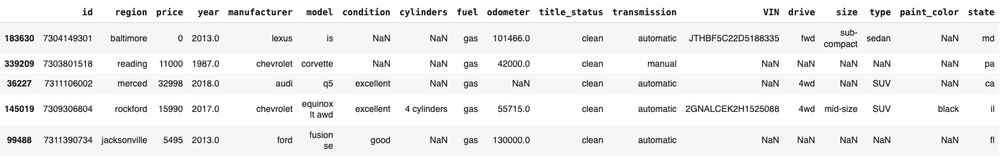
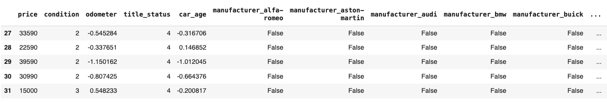
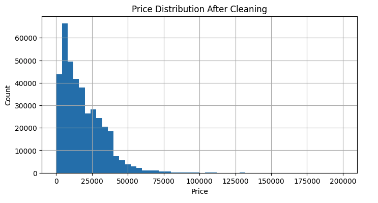
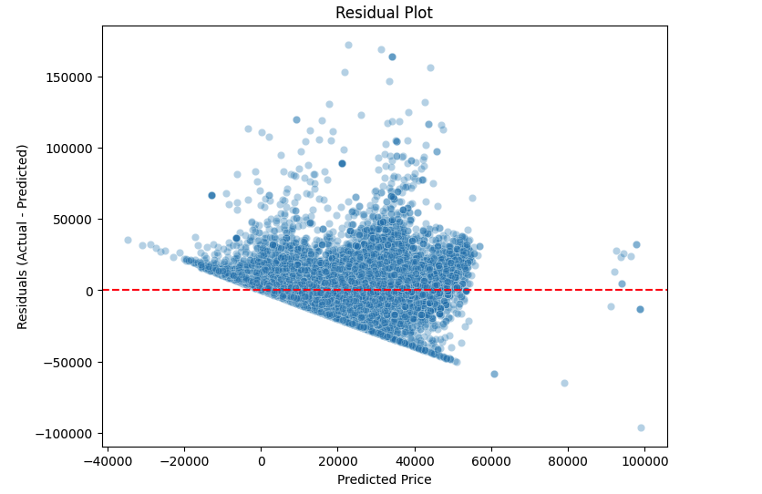
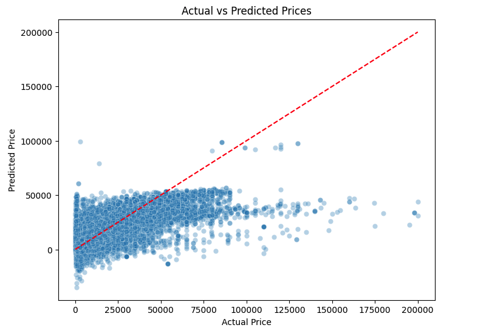
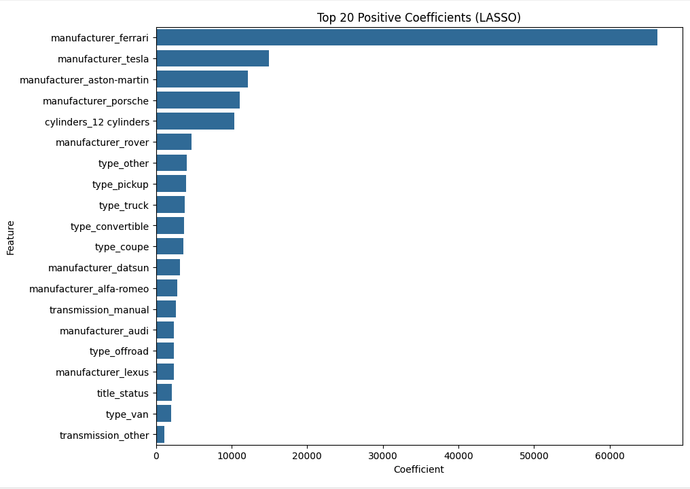
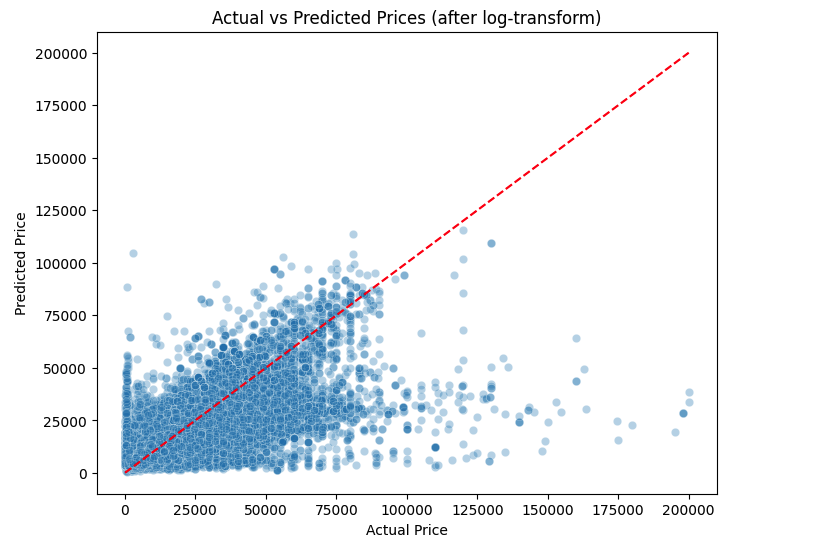
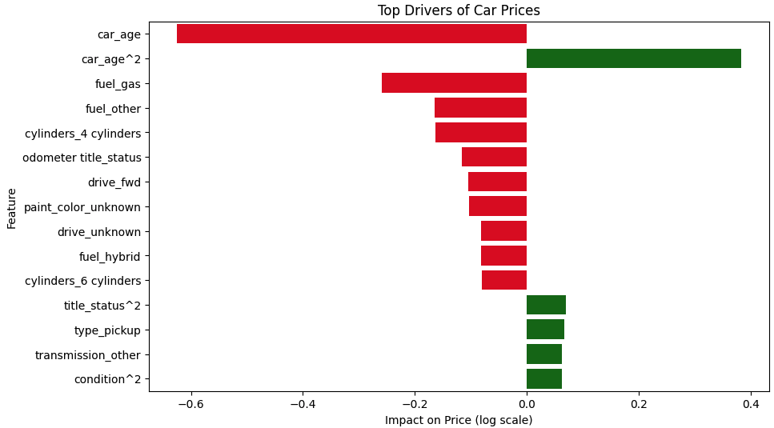

# UC Berkeley ML/AI project: What Drives the Price of a Car?
( Data analysis and visualization with python, pandas, dataframe, matplotlib, seaborn, sklearn, StandardScaler, PolynomialFeatures, 
OneHotEncoder, train_test_split, GridSearchCV, LinearRegression, Ridge, Lasso, RidgeCV, LassoCV, ElasticNetCV, mean_absolute_error, mean_squared_error, r2_score, SequentialFeatureSelector \
\
Project location: https://github.com/parthabiswas1/UCBerkeley-project-whatDrivesPriceOfCar ) 

## Problem Statement

### Understand why some used cars sell at a higer price, compared to others.
There are many factors like age, manufacturer, model, condition, odometer reading, fuel type, transmission, and drive that influence a used car buyer's decision to buy a car at a particular asking price. We need to find a way to identify the most important factors and their weightages that drive used car pricing so that the dealership can better price the car for quick sell.

### Objective of this project
Identify the most important factors that detrmine used car prices so the dealership can better price their vehicles and understand consumer preferences.

## Source of data

The dataset was provided by UC Berkeley School of Engineering and UC Berkley Haas school of Management for assigment for Professional Certificate in Machine Learning and Artificial Intelligence

## Approach

- Exploration ofthe data and formulation of data cleaning strategy
- Execution of the data cleaning strategy
- Creating a Modeling Plan
- Execution of the Models
- Evaluation of the Models
- Recommendatons to Car Dealers
  
Below are a summary of observations and findings.

## Data exploration results ** vehicles ** dataset

### Sample from original dataset

1. Did basic inspection of data - head(), dtypes, shape, describe()

2. Calculated missing counts percentages with isnull().sum() and identified columns that can be dropped because high % of data is missing. **size** qualifies as **70%** of size is missing.

3. VIN does not contribute much to the buying decision and 37% of VIN is missing. Good candidate to be dropped.

4. Decided that 'year' (more like age), 'odometer' readings are critical to buying decision. Only 0.28% of rows with 'year' are null and 1.03% of 'odometer' are null. These are small numbers and dropping these rows will ensure that all remaining rows have these values critical for the model to predict future price.

5. Looked for data outliers.   

   a) Cars older than 1950. Many of these cars have **placeholder price of $1.**.

   b) many have fake odometer readings (1, 10, 100 etc)     
   a)and b) together is **1213 rows only**, so decided to drop them.    

   c) There were **1386 rows** with odometer reading of 500K miles or more. Decided to drop them as they can skew the data.  

   d) Incorect pricing - Less than 100 and more than $200K. These were about 8.5% of the rows. Since these also can distort the model performance, decided to drop them.

## Data cleaning execution

(Data after cleaning)

1. **Data imputation** - All nulls in non numeric features are replaced with 'unknown'

2. **Drop Features (columns):**

   A. **id** - as this add no value to the car value.

   B. **size** - though size matters to a car value, **70%** of the data is missing.  

   C. **region and model** - Each contains too many elements, very difficult to convert to 'one hot encoding'.   

   D. **VIN** - adds no value to car value.  

   E. **state** - Though state is important (cars that sell in Texas more many be different from what sells in California) however with 'one hot encoding' it will explode the columns, so dropping it for how.

3. **Drop Observations (rows):**

   A.  **Year, Odometer** - These are critical and influences the price of used car, and the null rows are very few (Year - 0.28% and Odometer 1.03%). Dropping them will ensure that this data is avaliable in all remaining rows and help the performance of the models.  

   B. **Outliers** -
   
      i) Drop any vehicle older than 1950 and younger than 2025   

      ii) Odometer readings in negative or greater than 500K.

      iii) Price less than 100 or more than 200K

4. **Feature Engineering** -

   A. **Ordinal Encoding** -

     i) **Condition** has meaning- Encoded "salvage": 0, "fair": 1, "good": 2, "excellent": 3, "like new": 4, "new": 5, "unknown": -1

     ii) **title_status** has a clear hierarchy : "parts only": 0, "salvage": 1, "rebuilt": 2, "lien": 3, "unknown": 3, "missing": 3, "clean": 4. (gave same weightage to lien, unkown, missing )

   B. **One-hot encoding**
     
     fuel, transmission, drive, paint_color, type, manufacturer.

   C. **Feature creation**
   
     i) Created a column called **car_age**. Everyone wants to know how old is the car and the age is important to the buying decision.  

     Drop **year**, no more needed

   D **Scaling** Normalized numerical Features odometer, car_age.

(Note: I did not do PCA because I will be doing Ridge and LASSO. Ridge handles multicollinearity (features highly corelated to each other) by shrinking correlated coefficients. LASSO adds both shrinkage and feature selection. PCA removes collinearity but basically redundant in this scenario, it is also hard to interpret the data.)

Histogram has a right scewed shape - as price increases count decreases. Main cluster is around 5k - 20k. Long tail repesents expensive/luxury cars. Looks good. Ready to create model 

## **Modeling Plan**

**Objective:**
We want to understand what drives used car prices and build a model that can reasonably predict them.

1. I will start with a baseline **Linear Regression** model and establish a benchmark of MAE (Mean Squared Error, RMSE (Root Mean Squared Error) and R^2 (Coeff of Determination, If 1 then perfect fit, If 0= Model did not understand anything :-) , a -ve value will be worse than baseline)

2. I will do **Polynomial & Interaction** Features to expand the datset and capture non linear effects.

3. I will do Regularization: with **Ridge** (adds penalty to shrink coefficients) & **Lasso** (can reduce some coeffs to 0 there by removing features - feature selection) this is the way Lasso will reduce complexity of the model.

4. Next I wil create a pipeline and combine Ridge and Lasso to see if the model performance improves.  

5. After that I will do Sequential Feature Selector to reduce feature sets further if needed.

## **Model Execution Observations**

### Notes: Resource is a huge issue. Many of the Model executions did not complete. Moved to Google Colab and was able to complete some executions. Had to reduce parameters Cross Validation and Max iterations in LASSO to get the execution to complete. Could not club together ridge and lasso in a pipeline as it never completed.

### Strategy I
   Did **baseline LinearRegression** - Training and Test R^2 where close .555 and .558 which meant the model was stable. This also meant the model was only able to explain half the variations in the used car prices.     Test MAE: $ 6480.52, Test RMSE: $ 10011.37. So the predictions were off by quite a bit (comaprison table presented later ).

   After execution of **Ridge** there was not much change. Alpha=1

   After execution of **LASSO** very minimal change Test R^2: 0.555, Test MAE: $ 6479.7, Test RMSE: $ 10012.63

   \
   I was expecting residuals (errors) to be scattered randomly around 0. What I got was triangle/funnel shape. The residual spread gets wider as predicted price increases. SO errors aren’t constant across price levels. This could mean the model predicts cheaper cars more consistently, but does not do well with expensive ones.

   \
   the plot shows heavy clustering at lower prices (0–40k). Looks like the predictions are fairly reasonable in this range, but still spread out. The cloud falls below the diagonal and clustoring below 0 which many mean that the model predicts low prices for more expensive cars.

   

### Strategy II
   Log-transform target variable Price. Since there is a wide spread, prices are skewed, most are cheap cars but few are very expensive. Log will compress the scale. This will hopefully stabilize variance and makes regression handle extremes better.

 \
Test R^2: 0.443, Test MAE: $ 6447.59, Test RMSE: $ 10414.08. So there was minimal improvement, Model could explain only 44% of the variations, MAE and RMSE came down a bit.

### Strategy III
Explore non linear relationships for 'car_age', 'odometer', 'condition', 'title_status', PolynomialFeatures with degree=2. Polynomial expansion often creates features on very different scales. So standardization is important. Apply StandardScaler and then do RidgeCV and LassoCV to see if there is any improvements

 \
Test R^2: 0.4912195805665599, Test MAE: $ 5949.25, Test RMSE: $ 9878.06

### Strategy IV

Split the dataset into Luxury and Regular cars and try a two model strategy. Did not see any significant improvement

Linear Regression - Luxury Cars R^2 =0.425, MAE  8983.38, RMSE= 16381.599799
Linear Regression - Regular Cars R^2 =0.44, MAE  6384.412946, RMSE= 10275.45
 
 
 

# Why some used cars sell at a higer price, compared to others

##  Used Car Price drivers: Data-Driven Insights for Dealers

### Executive Summary

Using regression analysis on a large dataset of used car listings, I examined what drives vehicle prices in today’s market. My models achieved predictive performance 0.49–0.56, meaning they explain about half of the variation in prices. While not perfect, these results highlight key factors that consistently impact resale value.

The findings confirm that: car age, mileage, condition, brand, and title status are the most important price drivers.

### Age of the car is the top driver of price
Cars under five years will sell at a premium.

### Odometer is a prime driver of price
Low milage will sell at a premium. Higher odometer readings reduce price consistently.

### Condition & Title Status
Shows as positive drivers of price. A clean title and a car in good condition will sell at a higher price.

### Fuel type

Hybrid seems to be more preferred and a driver of price.
